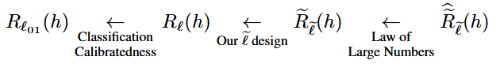

A PyTorch implementation of the loss correction method proposed in the paper ["Resurfacing the Instance-only Dependent Label Noise Model through Loss Correction"](https://openreview.net/pdf?id=tuvkrivvbG), accepted to ICLR 2026.

> **TL;DR:** We resurrect the instance-only dependent label noise model via loss correction that connects the empirical-noisy-risk with the true-clean-risk.

> **Abstract:**
We investigate the label noise problem in supervised binary classification settings and resurface the underutilized instance-only dependent noise model through loss correction. On the one hand, based on risk equivalence, the instance-aware loss correction scheme completes the bridge from empirical noisy risk minimization to true clean risk minimization provided the base loss is classification calibrated (e.g., cross-entropy). On the other hand, the instance-only dependent modeling of the label noise at the core of the correction enables us to estimate a single value per instance instead of a matrix. Furthermore, the estimation of the transition rates becomes a very flexible process, for which we offer several computationally efficient ways. Empirical findings over different dataset domains (image, audio, tabular) with different learners (neural networks, gradient-boosted machines) validate the promised generalization ability of the method.

Label noise is one of the culprits for low-quality data in supervised classification settings where some of the labels deviate from their true values. While it is relatively easy to collect data, it is as laborious to label them correctly in a time-efficient manner, which inevitably results in errors in annotations. One area affected by wrong annotations is automated seizure detection where, e.g., non-standard EEG montages in behind/around the ear can severely affect the label quality. The machines are prone to overfitting these mislabels, which results in poor generalization. The need for tackling noisy labels is therefore in order.

Loss correction is one prominent way of handling label noise in a machine-agnostic manner: given a possibly *noise intolerant* loss function (e.g., cross entropy), "correct" it by devising a new loss which is robust to label noise. These methods are easy to implement: usually the correction of the base loss takes a few lines of code with very little computational overhead, compared to, say, modifying an entire machinery.

Our loss correction design is based on risk equivalence: seeking a path from *empirical noisy risk minimization* to *true clean risk minimization*:



One uses a *transition probability* design to go from the noisy domain to the clean (unknown) one. While the literature is dominated by *y-dependent* and *X- and y-dependent* noise models, we take a different approach: *X-only-dependent* noise model, which is driven by the plausible assumption that *y*, being an aggregate statistic of *X*, does not convey any more information than X on the transition rate. This way, we estimate a scalar instead of a matrix per instance, for example.

In light of these, we devise a loss correction mechanism with instance-only dependent label noise model for binary classification tasks and test it on various domains (image, audio, tabular) with different machines (neural networks, gradient-boosted machines) against twelve other methods from the literature, and achieve promising results.

```none
@InProceedings{ndx,
  title = {Resurfacing the Instance-only Dependent Label Noise Model through Loss Correction},
  author = {Aydın, Mustafa Enes and De Vos, Maarten and Bertrand, Alexander},
  booktitle = {International Conference on Learning Representations},
  year = {2026},
}
```